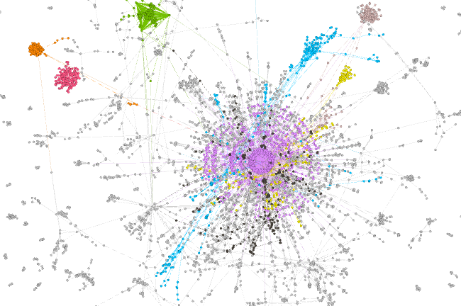
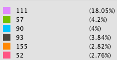
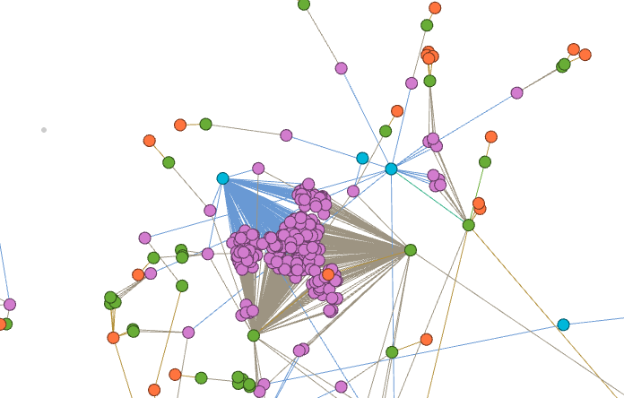
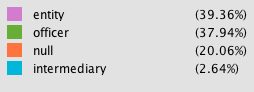

# Panama-Papers-Network-Analysis

## The Project
Social network analysis of the Panama Papers, with a specific emphasis in Saudi Arabia and Jordan. The network looks at the nodes between these two country and any other nodes irregardless of country of origin two degrees of freedom away.

Journalism...
Jordan and financial reform...

Understanding the social relationships identified within the Panama Papers may lead to a clearer understanding of how these methods of offshore structures are used to transfer money between Jordan and Saudi Arabia

Jordan-Saudi Arabia connection...

We then computed several centrality measure and report our observations in order to identify the key players.

## The Process
1) Load data. The code can be found in in the [load_and_clean2.py]()

2) Generate subgraph of model of interest: nodes with two degree or less from all nodes with country codes for Saudi Arabia (SAU) and The Hishamite Kingdom of Jordan (JOR).
The code can be found in in the [load_and_clean2.py]().

3) Generate initial graph, ego, in Gephi using ForceAtlas2
The code can be found in in the [load_and_clean2.py]().

4) Analyze community structures based on Louvian modularity, Q and centralities.
The code can be found in in the [measuring2.py]().

5) [Find person(s) of interest and tell a story]
The code can be found in in the [measuring2.py]().

## The Data
The Panama  Papers are a set of 11.5 million document leaks from Panamanian law company ”Mossack Fonseca”, which provides
information on approximately 360,000 businesses and individuals in more than 200 countries linked to offshore structures and covering a time period of nearly 40 years, from 1977 to 2016.

Link: https://www.occrp.org/en/panamapapers/database

The  ”ICIJ  Offshore”  database,  presents  the  network  of  relationships  between  companies  and  individual  people  with  offshore  companies based in tax havens. Consists in a directed and unweighted network based on commercial  registration  of  all  types  of  companies  involved  in  the  scandal  and the existing relations type, which are:

* "director of” - referring to the person appointed to the company’s management;

* ”address” - through which was possible to establish the country origin of the company;

* ”shareholder of” - if it holds a stake in an offshore company;

* ”intermediary of” - if it mediates companies in access to offshores;

* ”similar of” - if the company is related to another company, among other attributes.

How The Data Is Structured:

(source:https://guides.neo4j.com/sandbox/icij-paradise-papers/datashape.html)

* Entity (offshore): company, trust or fund created in a low-tax, offshore
   jurisdiction by an agent.

* Officer: person or company who plays a role in an offshore entity.

* Intermediary: a go-between for someone seeking an offshore corporation
  and an offshore service provider - usually a law-firm or a middleman that
  asks an offshore service provider to create an offshore firm for a client.

* Address: contact postal address as it appears in the original databases
  obtained by ICIJ

| Name          | Type          | Purpose | # of rows | Columns of interest |
| ------------- |:-------------:| -------:|----------:|------------:|
|  panama_papers_edges.csv    |    Edge       |   Each edge has a type of the represented relationship | 1,269,796    |   START_ID, TYPE, END_ID      |
| panama_papers_addresses.csv |    Nodes      |   Legal addresses of officers and entities  |   151,127  |      n/a   |
| panama_papers_entity.csv  |    Nodes      |   Legal entities (corporations, firms, and so on) |   319,421   |     name, jurisdiction    |
| panama_papers_intermediary.csv|    Nodes      |  Persons and organizations that act as links between other organizations| 23,642 |  name, country_code  |
| panama_papers_officer.csv  |    Nodes      | Persons (directors, shareholders, and so on)| 345,645 | name, country_code |

## Network Analysis Methods

* Clustering Coefficient: the fraction of possible triangles in an egocentric network that contain the ego node and exit. It measures the undefined for directed graphs

* Bridges: high  betweenness  individuals  are  often  critical  to  collaboration across different groups.

* Modularity: measure aims to identify the nodes that are more densely connected together than to the rest of the network, describing the network structure, i.e., how the network is compartmentalized into sub-networks

* Eigenvector centrality: identifies nodes that are surrounded by other nodes. Can be used to located groups of interconnected nodes with high prestige.

* PageRank: The rank of a node in the network is calculated as the probability that a s person randomly traversing the edges will arrive at the node.

## Model

[insert tables on centrality within subgraph]

As seen in table X, intermediary type nodes have the larger average number of degrees within the subgraph.

| Type          | Average Number of Degrees|
| ------------- |:-------------:|
| intermediary | 12.9781|
| Entity | 2.4506|
| Officer | 2.7303|

In table X, we have the Names of the top 10 nodes with the larges number of degrees.
| Name          | Type          | Number Number of Degrees |
| ------------- |:-------------:| -------:|
|RAWI_&_CO |(intermediary) |1475|
|BROCK_NOMINEES_LTD |(officer) |243|
|CREDIT_SUISSE__CHANNEL_ISLANDS____LTD |(intermediary) |224|
|TENBY_NOMINEES_LTD |(officer) |219|
|HELM_TRUST_COMPANY_LTD |(officer) |182|
|ARAB_PALESTINIAN_INVESTMENT_(HOLDING)_COMPANY_LTD |(entity) |98|
|DAMOR_INVESTMENTS_LTD |(officer) |92|
|CACIQUE_INVESTMENTS_LTD |(officer) |83|
|OLYMPIC_GOLD_HOLDINGS_LTD |(officer) |67|

## Repo Structure

## References
1. https://offshoreleaks.icij.org/pages/database
2. http://wps.fep.up.pt/wps/wp592.pdf
2. Complex Network Analysis in Python, Dmitry Zinoview, The Pragmatic Programmers. (2018)
